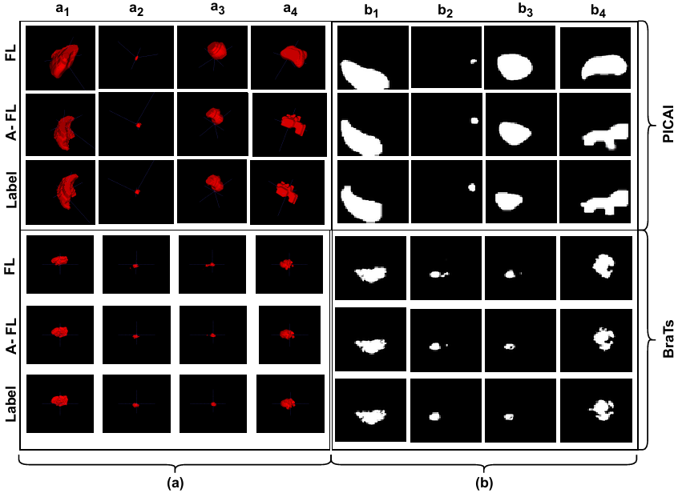

# AFL

> "Size and Smoothness Aware Adaptive Focal Loss for Small Tumor Segmentation".


### Abstract

- Adaptive Focal Loss (A-FL) is a novel loss function designed to enhance medical image segmentation, particularly for objects with irregular boundaries and small volumes. A-FL adjusts dynamically based on factors such as object surface smoothness, size, and class imbalance, which is defined by the ratio of the target area to the background. This enables the model to focus more effectively on challenging regions, improving segmentation accuracy.
- When tested on the PICAI 2022 dataset, A-FL achieved an Intersection over Union (IoU) score of 0.696 and a Dice Similarity Coefficient (DSC) of 0.769, outperforming standard Focal Loss (FL) by 5.5% and 5.4%, respectively. It also surpassed the best baseline method by 2.0% in IoU and 1.2% in DSC. In the BraTS 2018 dataset, A-FL achieved an IoU of 0.883 and a DSC of 0.931. These results demonstrate that A-FL significantly improves segmentation performance, surpassing traditional loss functions, including Dice Loss and Focal Loss, in key metrics like IoU and DSC.


### Diagram



> Qualitative results for the PICAI and BraTS validation sets are presented in both 3D (a) and 2D slice views (b). The rows labeled "Ground Truth," "A-FL," and "FL" display the actual labels, predictions from our Adaptive Focal Loss (A-FL) method, and predictions from the baseline Focal Loss (FL) method, respectively. For the PICAI dataset, the 3D views in (a) illustrate large (a₁) and small (a₂) volumes, as well as regions with good (a₃) and poor (a₄) smoothness. In the 2D slice views (b), the 14th and 2nd slices show large (b₁) and small (b₂) volumes, while the 9th and 7th slices highlight regions with good (b₃) and poor (b₄) smoothness. Similarly, for the BraTS dataset, the 3D views in (a) show large and small volumes, along with good and poor smoothness. The 2D slices in (b) display the 111th and 57th slices for large (b₁) and small (b₂) volumes, while the 50th and 94th slices demonstrate areas with good (b₃) and poor (b₄) smoothness.


### Performance Comparison of A-FL versus Various Baseline Loss Functions


| Loss           | IoU (PICAI) | Dice (PICAI) | Sens. (PICAI) | Spec. (PICAI) | IoU (BraTs) | Dice (BraTs) | Sens. (BraTs) | Spec. (BraTs) |
|----------------|-------------|--------------|---------------|---------------|-------------|--------------|----------------|----------------|
| Traversky      | 0.641       | 0.654        | 0.917         | 0.948         | 0.875       | 0.921        | 0.5221         | 0.6499         |
| CE             | 0.630       | 0.705        | 0.870         | 0.876         | 0.813       | 0.881        | 0.754          | 0.843          |
| IOU            | 0.654       | 0.727        | 0.917         | 0.947         | 0.893       | 0.930        | 0.701          | 0.796          |
| Dice           | 0.665       | 0.739        | 0.904         | 0.952 ↑       | 0.891       | 0.933        | 0.654          | 0.745          |
| Dice CE        | 0.670       | 0.742        | 0.938         | 0.927         | 0.829       | 0.889        | 0.845          | 0.882          |
| DiceFocal      | 0.685       | 0.757        | 0.896         | 0.949         | 0.884       | 0.927        | 0.954          | 0.947          |
| FL             | 0.690       | 0.726        | 0.715         | 0.924         | 0.869       | 0.922        | 0.954          | 0.947          |
| **A-FL**       | **0.696 ↑** | **0.769 ↑**  | **0.951 ↑**   | **0.9501**    | **0.884**   | **0.927**    | **0.960**      | **0.955 ↑**    |


### Performance Comparison of A-FL versus Regular FL across Baseline Segmentation Models on PICAI and BraTs Datasets

| Model                 | Loss | IoU (PICAI) | Dice (PICAI) | Sens. (PICAI) | Spec. (PICAI) | IoU (BraTs) | Dice (BraTs) | Sens. (BraTs) | Spec. (BraTs) |
|-----------------------|------|-------------|--------------|---------------|---------------|-------------|--------------|---------------|---------------|
| **UNet**              | FL   | 0.640       | 0.710        | 0.721         | 0.749         | 0.831       | 0.894        | 0.849         | 0.827         |
|                       | A-FL | **0.669 ↑** | **0.740 ↑**  | **0.792 ↑**   | **0.825 ↑**   | **0.897 ↑**| **0.940 ↑**  | **0.872 ↑**  | **0.849 ↑**   |
| **AttUNet**           | FL   | 0.647       | 0.721        | **0.997 ↑**   | 0.940         | 0.783       | 0.855        | **0.956 ↑**   | **0.936 ↑**   |
|                       | A-FL | **0.679 ↑** | **0.750 ↑**  | 0.992         | **0.948 ↑**   | **0.878 ↑** | **0.926 ↑**  | 0.904         | 0.929         |
| **RegUNet**           | FL   | 0.562       | 0.622        | 0.600         | **0.950 ↑**   | 0.722       | 0.807        | **0.891 ↑**   | **0.925 ↑**   |
|                       | A-FL | **0.573 ↑** | **0.635 ↑**  | **0.691 ↑**   | 0.944         | **0.770 ↑**| **0.841 ↑** | **0.882 ↑**   | **0.947 ↑**   |
| **RRUNet**            | FL   | 0.634       | 0.709        | 0.967         | 0.946         | 0.835       | 0.874        | 0.892         | 0.927         |
|                       | A-FL | **0.672 ↑** | **0.740 ↑**  | **0.989 ↑**   | **0.949 ↑**   | **0.883 ↑**| **0.905 ↑** | **0.916 ↑**   | **0.937 ↑**   |
| **UNet with ResNet50**| FL   | 0.641       | 0.715        | 0.924         | 0.947         | 0.867       | 0.922        | 0.954         | 0.947         |
|                       | A-FL | **0.696 ↑** | **0.769 ↑**  | **0.941 ↑**   | **0.949 ↑**   | **0.898 ↑** | **0.951 ↑** | **0.962 ↑**   | **0.949 ↑**   |
| **SegResNet**         | FL   | 0.626       | 0.701        | **0.991 ↑**   | 0.934         | 0.849       | 0.908        | **0.903 ↑**   | **0.967 ↑**   |
|                       | A-FL | **0.691 ↑** | **0.763 ↑**  | **0.994 ↑**   | **0.943 ↑**   | **0.889 ↑** | **0.941 ↑**  | 0.886         | 0.949         |
| **VNeT**              | FL   | 0.593       | 0.656        | 0.570         | **0.958 ↑**   | 0.821       | 0.884        | 0.911         | **0.947 ↑**   |
|                       | A-FL | **0.626 ↑** | **0.689 ↑**  | **0.740 ↑**   | 0.947         | **0.846 ↑** | **0.897 ↑**  | **0.950 ↑**   | 0.928         |
| **MRRN**              | FL   | 0.634       | 0.708        | **0.918 ↑**   | 0.945         | 0.827       | 0.889        | 0.827         | 0.931         |
|                       | A-FL | **0.688 ↑** | **0.760 ↑**  | 0.893         | **0.948 ↑**   | **0.899 ↑** | **0.940 ↑**  | **0.915 ↑**   | **0.938 ↑**   |

## Links
Here are [[`Paper`](https://arxiv.org/pdf/2407.09828)].

## Dataset
1. PICAI Dataset:
We follow the [Unet Dataset Preparation](https://github.com/DIAGNijmegen/picai_baseline/blob/main/unet_baseline.md) to download and setup the train and est sets.     
It is recommended to arrange the dataset as the following.  

```
├── ./data 
    ├── TrainImage
        ├── patint_adc
        ├── patint_t2w 
        └── patint_hbv
    ├── TrainLabel
        └── patint_gt 
    ├──ValidImage
        ├── patint_adc
        ├── patint_t2w
        └── patint_hbv
    ├── ValidLabel 
        └── patint_gt
```

2. BraTS Dataset
It is recommended to arrange the dataset as the following. 
```
├── ./data 
    ├── TrainImage
        ├── patint_image
    ├── TrainLabel
        └── patint_gt 
    ├──ValidImage
        ├── patint_image
    ├── ValidLabel 
        └── patint_gt
```

## Training Session
The overall framework for training this U-Net has been set up using various modular components from the [`monai`](https://github.com/Project-MONAI/MONAI) module and Loss Function

```bash
python main.py --data_dir "./PICAI_dataset/" --model_dir "./picai/trained_model/" --epochs 200

```

### Trained Model

Please see the pretrained models, and set up the path to these models properly, visit the link:

[PICAI](https://drive.google.com/file/d/19il6dyX11NpZWkn_PtK80TQ3uD0q79zO/view?usp=drive_link) | [BraTS](https://drive.google.com/file/d/1UrbJB9t9VvKdsSsDKpmjH5fRTqtCvYXA/view?usp=drive_link) 


### Requirements

- **Python**: 3.7.13
- **PyTorch**: 2.5.1 (Stable)
- **CUDA**: 11.8, 12.1, 12.4
- **ROCm**: 6.2
- **Torchvision**: 0.14.0
- **Torchaudio**: Latest stable version

### Installation

You can install PyTorch, Torchvision, and Torchaudio using the following command:

#### Using `pip`:

For **CUDA 11.8**:

```bash
pip3 install torch torchvision torchaudio 
```


## Citation

If you find these projects useful, please consider citing:

```bibtex
@article{islam2024enhancing,
  title     = {Enhancing Semantic Segmentation with Adaptive Focal Loss: A Novel Approach},
  author    = {Md Rakibul Islam and Riad Hassan and Abdullah Nazib and Kien Nguyen and Clinton Fookes and Md Zahidul Islam},
  year      = {2024},
  month     = {July},
  day       = {13},
}

```